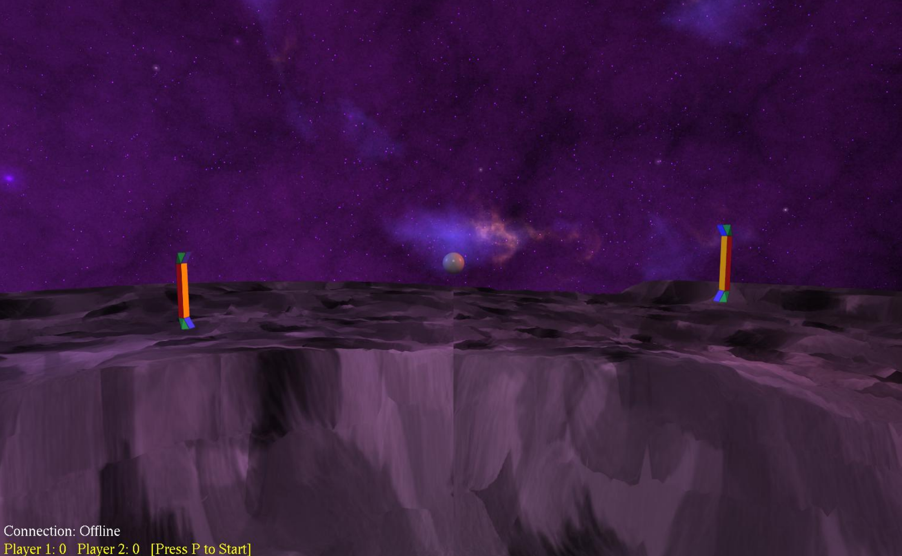

# Space-Pong 🎮🚀

**Space-Pong** is a 3D futuristic take on the classic Pong arcade game. Built as part of the CSc 165 course, the game supports single and multiplayer modes with networked gameplay and custom 3D assets.

## 🖥️ Screenshot



## 📦 Compile & Run Instructions

1. Navigate to the project folder.
2. Set multiplayer mode in `MyGame.java`:
   ```java
   isMultiplayerMode = true; // or false
   ```
3. To compile the game:
   ```
   Run compile.bat
   ```
4. To run in multiplayer mode:
   - Start the server:
     ```
     Run server.bat
     ```
   - Start one or more clients:
     ```
     Run client.bat [server-ip] [port] [udp]
     ```

## 🕹️ How to Play

| Control        | Action                      |
|----------------|-----------------------------|
| `W` / `S`      | Move paddle up/down         |
| Arrow Keys     | Rotate camera               |
| `ESC`          | Disconnect from game        |
| `P`            | Start game                  |
| `HOME`         | Test paddle animation       |

## 🔆 Lighting

- Global ambient lighting
- Blue and red side lights for each player

## 🌐 Networking

- Multiplayer support using client-server architecture
- Network protocol enhancements:
  - Player number & paddle model in `CREATE` messages
  - Ball sync, score sync, and bounce event handling

## 🧠 Game Details

- **Genre:** Arcade  
- **Theme:** Futuristic Pong  
- **Style:** 3D  
- **Core Gameplay:** Paddle control, ball bouncing, network multiplayer

## 🎨 Assets

- Custom paddle model (created in Blender)
- Terrain, height maps, paddle textures (created in Paint)
- Skybox (created in Spacescape)
- Sound effects (generated using bfxr)

> Note: Other assets from CSc-165 or CSc-155 sample sets were not used in the final build.

## 👨‍💻 Author

- Egor Strakhov (Solo Developer)

---

*Built for the CSc 165 Final Project.*
